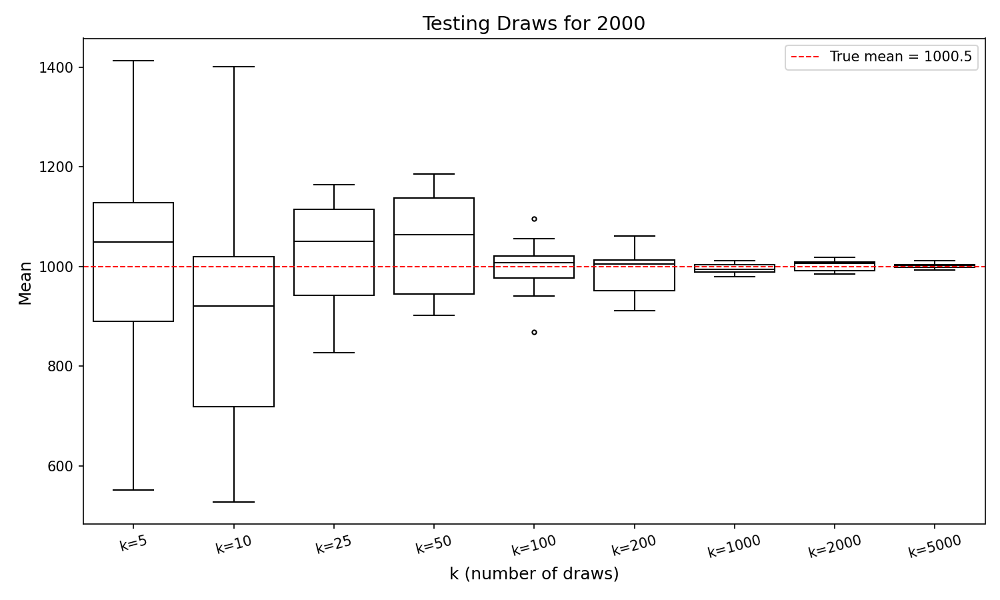

# Law of Large Numbers — Snakemake Pipeline

Demonstrates the Law of Large Numbers by sampling integers from `1` to `n`
and showing how the sample mean converges to the true mean as `k` increases.

## Result Plot (n = 2000, k up to 5000)


## Folder Structure

```
BET-104_lln-pipeline/
├── config.yaml          # Pipeline parameters (n, k_values, repeats)
├── Snakefile            # Snakemake rules (all, generate_data, plot)
├── scripts/
│   ├── generate_data.py # Simulates sampling, saves results/data.csv
│   └── plot.py          # Reads CSV, generates results/plot.png
├── results/             
│   ├── data.csv
│   └── plot.png
└── README.md
```

## Requirements

```bash
pip install snakemake numpy pandas matplotlib seaborn
```

## Run

```bash
snakemake --cores 1
```

## Configuration (`config.yaml`)

| Parameter  | Default                              | Description                        |
|------------|--------------------------------------|------------------------------------|
| `n`        | `2000`                               | Upper bound of sampling range      |
| `k_values` | `[5,10,25,50,100,200,1000,2000,5000]`| Sample sizes to test               |
| `repeats`  | `10`                                 | Number of repetitions per k        |

To test a different range (e.g. a dice: `n=6`), just edit `config.yaml` — no code changes needed.

## Output

- **`results/data.csv`** — columns: `k`, `repeat`, `mean`
- **`results/plot.png`** — boxplot titled *"Testing Draws for {n}"*

## Pipeline DAG

```
all
 └── plot  (results/plot.png)
      └── generate_data  (results/data.csv)
```
